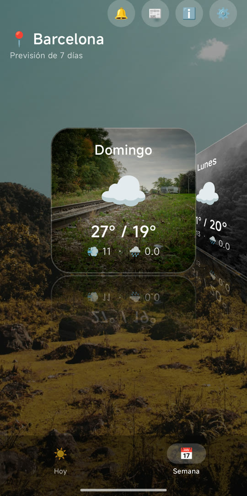
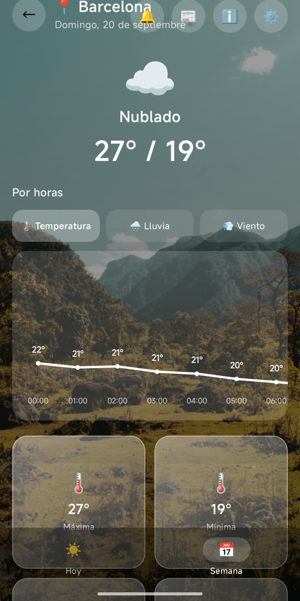
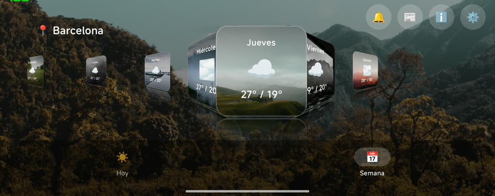
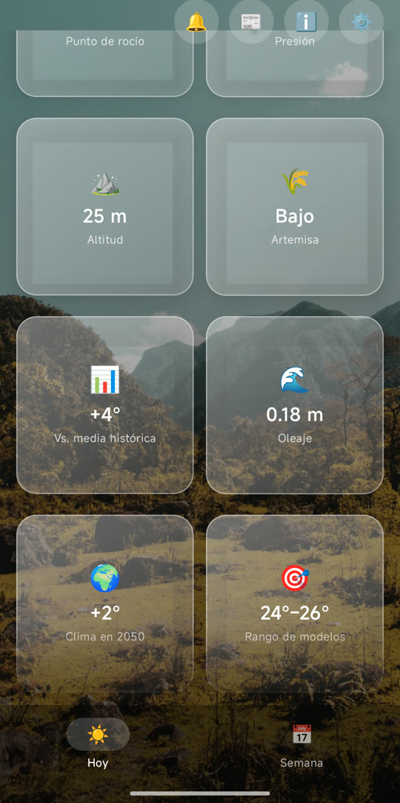

# Tiempo

Una app del tiempo para Android, sencilla y bonita: la previsión de los próximos 7 días
sobre fotos de paisajes que cambian con la hora del día y con el tiempo que va a hacer.

Sin cuenta, sin anuncios y sin rastreo.

<p align="center">
  
  
  
</p>

---

## Qué puedes hacer con ella

### Ver el tiempo de hoy

La pantalla principal te da lo que necesitas de un vistazo: la temperatura de ahora, el
cielo que hace, la máxima y la mínima del día, y una gráfica de las próximas 24 horas que
puedes cambiar entre **temperatura**, **lluvia** y **viento**.

Debajo tienes las cifras del día en tarjetas: máxima, mínima, viento, precipitación y
probabilidad de lluvia. Toca cualquiera y te explica qué significa ese dato.

### Recorrer la semana

La pestaña **Semana** es un carrusel: cada día es una tarjeta con su propia foto, elegida
según el tiempo que hará ese día — si el jueves llueve, el jueves enseña lluvia. Arrastra
desde cualquier punto de la pantalla para moverlo, y toca una tarjeta para abrir el día.

En horizontal el carrusel se reorganiza y enseña la semana entera de un vistazo: la
tarjeta del centro grande y las demás encogiendo hacia los lados.

<p align="center">
  
</p>

### Entrar en el detalle de un día

Cada día tiene su propia pantalla, con la previsión hora a hora y el desglose completo:
temperaturas, viento, lluvia, amanecer, atardecer y fase lunar.

### Elegir qué datos quieres ver

En **Ajustes** decides qué información extra aparece, y puedes apagar la que no te
interese:

| | |
|---|---|
| 🌅 **Sol y luna** | Amanecer, atardecer, horas de luz y fase lunar |
| 🌤️ **Datos atmosféricos** | Índice UV, radiación solar, punto de rocío y presión |
| 🌾 **Polen** | Tipo de polen predominante y su nivel (solo en Europa) |
| ⛰️ **Altitud** | Metros sobre el nivel del mar de tu ubicación |
| 📊 **Media histórica** | Cuánto se sale hoy de lo normal en esa fecha, según los últimos 15 años |
| 🌊 **Oleaje** | Altura de las olas del mar más cercano (solo en la costa) |
| 🏞️ **Ríos** | Caudal estimado del río más cercano |
| 🌍 **Cambio climático** | Cuánto subirá la temperatura media en 2050 en tu zona |
| 🎯 **Incertidumbre** | En qué margen se mueven las distintas simulaciones del modelo |

<p align="center">
  
</p>

### Ponerla en la pantalla de inicio

Hay un **widget** con la previsión, y puedes elegir cómo se ve: con la misma foto que la
app, transparente para que se vea tu fondo de pantalla, o de un color liso (azul noche,
gris pizarra, verde bosque, morado, rojo oscuro o negro).

### Recibir el parte por la mañana

Si quieres, la app te manda **una notificación al día** con el resumen del tiempo. Eliges
la hora (por defecto, las 8:00) o la apagas del todo.

---

## Cambiar de ciudad

Busca tu ciudad por el nombre y la app la recuerda. Puedes guardar varias e ir cambiando
entre ellas.

**No usa el GPS**: la app ni siquiera pide permiso de ubicación. Tú le dices dónde quieres
mirar el tiempo, y ya.

---

## De dónde sale todo

- **La previsión** viene de [Open-Meteo](https://open-meteo.com), un servicio meteorológico
  abierto y gratuito que reúne los modelos de varias agencias nacionales.
- **Las fotos** vienen de [Unsplash](https://unsplash.com) y son de fotógrafos de todo el
  mundo. En la pantalla de **Info** tienes el nombre y el perfil de los autores de las
  fotos que la app está usando en ese momento.

## Qué hace la app con tus datos

Nada. No hay cuenta que crear, no hay anuncios, no hay estadísticas de uso ni perfiles.
Lo que eliges (tu ciudad, los datos que quieres ver, la hora del aviso) se queda guardado
en tu móvil y no sale de ahí.

Para darte la previsión, la app consulta al servidor de Open-Meteo las coordenadas de la
ciudad que hayas elegido. Nada más.

---

## Para quien quiera compilarla

Proyecto nativo de **Kotlin + Jetpack Compose**, sin dependencias de servicios de Google.

1. Ábrelo con Android Studio (Ladybug o superior) y espera al *Gradle Sync*.
2. Ejecútalo en un móvil o emulador con **Android 8.0 (API 26)** o superior.

Los datos del tiempo no necesitan ninguna clave. Las fotos de fondo sí: crea una app
gratis en [unsplash.com/developers](https://unsplash.com/developers) y añade su clave a
`local.properties`:

```
UNSPLASH_ACCESS_KEY=tu_clave
```

Sin clave, la app funciona igual: en vez de fotos usa un degradado.

### Estructura

```
app/src/main/java/com/example/tiempo/
├── MainActivity.kt        # arranque
├── Config.kt              # ajustes generales
├── data/                  # red, modelos y preferencias
├── ui/                    # pantallas Compose
├── notifications/         # aviso diario
└── widget/                # widget de pantalla de inicio
```

Kotlin 2.0 · AGP 8.7 · Compose BOM 2024.12 · Retrofit · Glance · Coil
